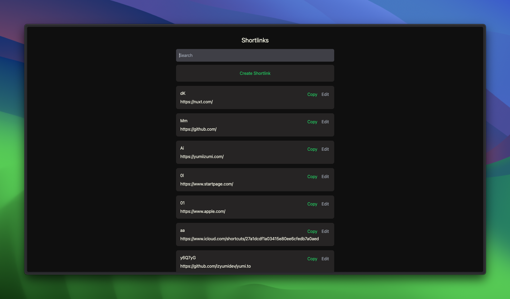

# yumi.to

Your personal URL shortener built with Nuxt, DynamoDB, AWS (SST), and TailwindCSS.



## Features

- 100% free! (runs inside AWS free tiers: Lambda, CloudFront, DynamoDB) and open-source
- Create shortlinks via dashboard or an API call
- Shortlinks can be manually created or automatically generated
- Use your own domain name
- Authentication with GitHub (OAuth) or API key
- Support for various short-link dictionary
  - From DynamoDB
  - From JSON-based dictionary
- Preconfigured iOS Shortcuts

## Installation

### Requirements

There is no requirement to use this project, but the following are recommended:

- Domain name (e.g. `yumi.to`)
- AWS account with a Route 53 hosted zone for your domain

### Link storage (DynamoDB)

Links live in a DynamoDB table named `Shortlinks` (created by `sst.config.ts`):

- `pk` (string, partition key) — always `"LINK"`
- `sk` (string, sort key) — the `short` value
- Attributes: `id`, `short`, `link`, `created_at`

To import existing links from a JSON export (`shortlinks-*.json`):

```sh
uv run scripts/import-links.py --table Shortlinks shortlinks-2026-01-01.json
```

### Deploying

1. Fork this repository
2. Set the required SST secrets (values are stored in SSM Parameter Store, never in files):

   ```sh
   npx sst secret set GithubClientId <github-oauth-client-id> --stage production
   npx sst secret set GithubClientSecret <github-oauth-client-secret> --stage production
   npx sst secret set SessionPassword <32-plus-random-chars> --stage production
   npx sst secret set ApiKeyHash <api-key-hash-for-ios-shortcut> --stage production
   npx sst secret set AdminGithubId <your-numeric-github-user-id> --stage production
   ```

3. Set the `AWS_DEPLOY_ROLE_ARN` repo variable (GitHub Actions → OIDC role for deploys).
4. Push to `main` (or deploy manually):

   ```sh
   npx sst deploy --stage production
   ```

5. Point your domain at the CloudFront distribution (SST manages the Route 53 alias record).

The first deploy targets the staging domain (`l-next.ajm.codes` in `sst.config.ts`).
At cutover, change the domain constant to the production domain and redeploy.

### Authentication with GitHub

By default, this project uses GitHub as the authentication provider via
`nuxt-auth-utils` (sealed-cookie session, no external auth service).

1. Create a GitHub OAuth App with callback `https://<your-domain>/auth/github`
2. Store the client ID/secret with `npx sst secret set GithubClientId ...` /
   `GithubClientSecret ...` (see Deploying)
3. Set `AdminGithubId` to your numeric GitHub user ID — only that user can
   list, search, create, edit, or delete links

### Using with iOS Shortcuts

You can use this project with iOS Shortcuts to create a custom URL shortener. To do this, you can use the following shortcut:

1. Create an API key
   1. Create a random string as the API key
   2. Store that API key string as `ApiKeyHash` with `npx sst secret set ApiKeyHash ... --stage production`
2. Get the shortcut [here](https://yumi.to/aa)
3. First time you run the shortcut, you will be prompted to enter your domain name (e.g. `yumi.to`) and the API key you created in step 1
4. You are now ready to use the shortcut!

## License

This project is licensed under the MIT License - see the [LICENSE](LICENSE) file for details.

## Acknowledgements

- [AWS SST](https://sst.dev)
- [Nuxt](https://nuxtjs.org)
- [TailwindCSS](https://tailwindcss.com)
- [Create a Scalable URL Shortener App Using Nuxt 3, Supabase, and TainwilndCSS](https://youtube.com/watch?v=A3OO1ZVLRjA)
